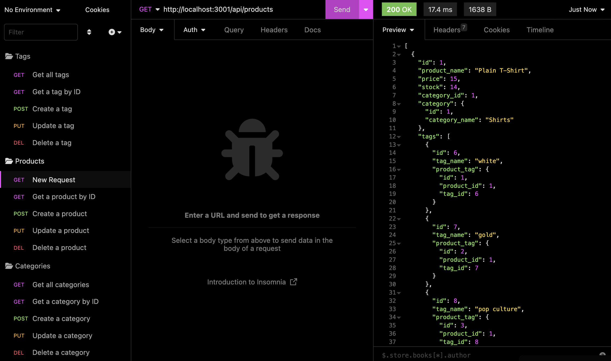

# ORM-E-Commerce-Back-End
- [Description](#description)
- [Installation](#installation)
- [Usage](#usage)
- [Screenshot](#screenshot)
- [Contributions](#contributions)
- [License](#license)
- [Questions](#license)
- [Credits](#credits)
- [Video-Tutorial](#video-tutorial)

# Description
A mysql database and application backend for an e-commerce site. Built using MySQL2, Express, Sequelize and dotenv. 

# Installation
The user will first have to `git clone` the repository into their local machine.  
In order for the user to use the application, the command 'npm install' has to be ran. 
The user then has to install and run the following dependencies:   
`npm i inquirer` 
`npm i sequelize`  
`npm i dotenv`  
`npm i express`  

# Usage
The user will then proceed to type in the terminal `mysql -u root -p` and this will connect to their database 
The user will then run `source schema.sql` 
The user will then quit MySQL and run the following command to view the files, `npm run seed` 
The user will then run `npm start`

# Screenshot

# Contributions
At this moment, there is no need for contributuons for this application. 

# License
   

# Questions
You can [email](rayito.aguirre94@gmail.com) me if there is any questions or comments that arise from this application. 
You can also get a hold of me through my [GitHub](https://github.com/itsrayito) account.

# Credits
This application was made entirely by Rayito Aguirre   
Lecture videos, class sessions, and helpful websites on ORM provided by Rice University Coding Bootcamp instructors in partnership with edX. 

# Video-Tutorial

